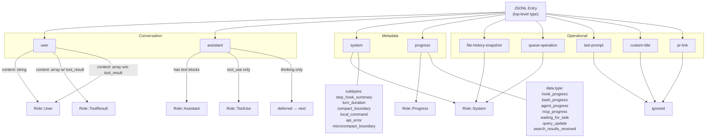

# Claude Code Message Types — Complete Reference

> Definitive catalog of every message type produced by Claude Code, how claude-view parses them, and how they map to the UI.
>
> **Date:** 2026-02-27
> **Status:** Current (Claude Code CLI as of Mar 2026)
> **Last Evidence Audit:** 2026-03-08 against real JSONL corpus (5,932 files, ~997,878 lines)
> **Methodology:** All structural analysis via `jq` JSON parsing — never text grep — to avoid miscategorizing message text content as structural fields
> **Pre-release guard:** `scripts/integrity/evidence-audit.sh` validates parser against this spec before every release

---

## Quick Reference — Type Taxonomy Tree

```
JSONL Entry (top-level "type" field)
│
├── CONVERSATION TYPES ──────────────────────────────────────────────
│
│   ├── "user" ──────────────────────── → Role::User | Role::ToolResult
│   │   ├── message.content: string ──── → Role::User (human prompt)
│   │   └── message.content: array
│   │       ├── [tool_result] ─────────── → Role::ToolResult
│   │       ├── [text] ───────────────── → Role::User
│   │       └── [image] ──────────────── → Role::User (screenshot)
│   │
│   └── "assistant" ─────────────────── → Role::Assistant | Role::ToolUse
│       └── message.content: array
│           ├── [text] ───────────────── → Role::Assistant
│           ├── [thinking] ───────────── (deferred to next assistant)
│           │   └── keys: {thinking, signature, type}
│           └── [tool_use] ──────────── → Role::ToolUse (if no text blocks)
│               └── keys: {id, name, input, type, caller?}
│
├── METADATA TYPES ──────────────────────────────────────────────────
│
│   ├── "system" ────────────────────── → Role::System (category: "system")
│   │   └── .subtype:
│   │       ├── stop_hook_summary ────── Hook execution summary
│   │       ├── turn_duration ────────── Turn timing metadata
│   │       ├── compact_boundary ─────── Context compaction marker
│   │       ├── local_command ────────── CLI command (e.g. /mcp)
│   │       ├── api_error ────────────── API error with retry info
│   │       └── microcompact_boundary ── Micro-compaction (rare)
│   │
│   └── "progress" ──────────────────── → Role::Progress
│       └── .data.type:
│           ├── hook_progress ────────── Hook execution in flight
│           ├── bash_progress ────────── Bash command output streaming
│           ├── agent_progress ───────── Sub-agent activity
│           │   └── content path: data.message.message.content[]
│           │       (double-nested — .data.message is envelope,
│           │        .data.message.message is the API response)
│           ├── mcp_progress ─────────── MCP tool execution
│           ├── waiting_for_task ─────── Sub-agent waiting
│           ├── query_update ─────────── Search query executing
│           └── search_results_received  Search results returned
│
├── OPERATIONAL TYPES ───────────────────────────────────────────────
│
│   ├── "file-history-snapshot" ──────── → Role::System (category: "snapshot")
│   │   └── keys: {type, messageId, snapshot, isSnapshotUpdate}
│   │       (no uuid, no sessionId, no timestamp at top level)
│   │
│   ├── "queue-operation" ────────────── → Role::System (category: "queue")
│   │   └── .operation: enqueue | dequeue | remove | popAll
│   │       keys: {type, operation, sessionId, timestamp, content?}
│   │       (no uuid)
│   │
│   ├── "last-prompt" ───────────────── → (silently ignored by parser)
│   │   └── keys: {type, sessionId, lastPrompt}
│   │       Stores most recent user prompt text for session preview
│   │
│   ├── "custom-title" ──────────────── → (silently ignored by parser)
│   │   └── keys: {type, sessionId, customTitle}
│   │       User-set custom session title
│   │
│   └── "pr-link" ───────────────────── → (silently ignored by parser)
│       └── keys: {type, sessionId, prNumber, prUrl, prRepository, timestamp}
│
└── FORWARD COMPATIBILITY ───────────────────────────────────────────
    └── Unknown type values → silently ignored via wildcard match
```

### Mermaid Diagram



---

## 1. Two Message Sources

Claude Code produces messages through **two independent channels**. Claude-view consumes both and merges them into a single conversation timeline.

```text
┌──────────────────────────────────────────────────────────────┐
│                     Claude Code CLI                          │
│                                                              │
│  Channel A: JSONL file                Channel B: Hooks       │
│  ~/.claude/projects/…/session.jsonl   POST /api/hooks        │
│                                                              │
│  • Conversation content               • Lifecycle events     │
│  • Tool calls + results               • Agent state (FSM)    │
│  • Thinking blocks                    • Permission requests  │
│  • System metadata                    • Sub-agent lifecycle   │
│  • Progress indicators                • Task completion       │
│                                       • Context compaction    │
└──────────┬───────────────────────────────────┬───────────────┘
           │                                   │
           ▼                                   ▼
   ┌───────────────┐                  ┌────────────────┐
   │  JSONL Parser  │                  │  Hook Handler  │
   │  (Rust: core)  │                  │  (Rust: server)│
   └───────┬───────┘                  └───────┬────────┘
           │                                   │
           │        ┌──────────────┐           │
           └───────►│  Merged UI   │◄──────────┘
                    │  Timeline    │
                    └──────────────┘
```

**Two distinct data types — NOT duplicates:**

- **JSONL `hook_progress`** (Channel A) = progress events. Real-time activity indicators written by Claude CLI to the session file. They belong to the `progress` category.
- **SQLite `hook_events`** (Channel B) = lifecycle events captured by claude-view's hook handler. Structured state transitions received via `POST /api/live/hook`.

These are **different data from different channels**. Both are shown in the timeline. Never deduplicate them.

---

## 2. JSONL Entry Types (Channel A)

Every line in a session JSONL file is a JSON object with a top-level `"type"` field. The parser handles **8 known types** plus silently ignores unknown types via a wildcard.

### Evidence Baseline (2026-03-08)

| Type | Count | % of corpus |
|------|------:|------------:|
| `progress` | 574,592 | 57.6% |
| `assistant` | 240,319 | 24.1% |
| `user` | 167,503 | 16.8% |
| `file-history-snapshot` | 8,874 | 0.89% |
| `queue-operation` | 8,829 | 0.88% |
| `system` | 7,384 | 0.74% |
| `last-prompt` | 150 | 0.015% |
| `pr-link` | 12 | 0.001% |
| `custom-title` | 2 | <0.001% |

**Types with ZERO occurrences** (documented historically but absent from current corpus):
- `summary` — 0 across 5,932 files. May have existed in older Claude Code versions.
- `result` — 0. Parser has a match arm for forward compat. Dead code.
- `saved_hook_context` — 0. May appear in future hook-context-injecting workflows.
- `hook_event` — 0 in JSONL. These arrive via HTTP Channel B only.

### 2.1 Core Conversation Types

#### `user`

User-originated messages. The `message.content` shape determines the parsed Role.

```jsonc
// String content → Role::User (human prompt)
{"type":"user","uuid":"u1","parentUuid":"p1","timestamp":"…","sessionId":"…",
 "version":"2.1.56","isSidechain":false,"userType":"external",
 "cwd":"/path","gitBranch":"main",
 "message":{"role":"user","content":"Fix the bug in auth.rs"}}

// Array with tool_result blocks → Role::ToolResult (tool output returning to Claude)
{"type":"user","uuid":"u2","parentUuid":"a1","timestamp":"…",
 "sourceToolAssistantUUID":"a1","toolUseResult":"fn auth() {}",
 "message":{"role":"user","content":[
   {"type":"tool_result","tool_use_id":"tu1","content":"fn auth() {}"}
 ]}}
```

**Content routing** (parser.rs `parse_user_entry()`):

| `message.content` shape | Parsed Role | Evidence count |
|---|---|---|
| `String` | `Role::User` | 11,064 (7%) |
| `Array` with any `tool_result` block | `Role::ToolResult` | ~151,917 entries |
| `Array` without `tool_result` blocks | `Role::User` | ~3,997 entries |

**`.message` sub-object keys:** Always exactly `{role, content}` — no other keys (verified on 167,503 entries).

**Content block types** (within `message.content[]` arrays):

| Block `type` | Count | Fields |
|---|---|---|
| `tool_result` | 151,917 | `tool_use_id`, `content`, `type`; `is_error` present on ~26% only |
| `text` | 4,611 | `text` |
| `image` | 143 | `source: {type: "base64", media_type, data}` |

**`tool_result` block keys:**
- Always present: `content`, `tool_use_id`, `type` (152,034 entries)
- Optional: `is_error` (39,641 entries, ~26%). When no error, the field is **absent** — not `false`.

**Behaviors:**

- `isMeta: true` entries are **skipped** by the parser. 2,811 entries total (100% user type). Content shapes: 1,882 array, 929 string.
- Command tags (`<command-name>`, `<command-args>`, `<command-message>`, `<local-command-stdout>`, `<system-reminder>`) are stripped from content.
- Backslash-newline sequences (`\\\\\\n`) are normalized to `\\n`.

**Top-level keys on `user` entries:**

| Key | Presence | Notes |
|---|---|---|
| `type`, `uuid`, `parentUuid`, `timestamp`, `sessionId`, `version`, `isSidechain`, `userType`, `cwd`, `gitBranch`, `message` | Always | Core fields |
| `slug` | ~98% | Human-readable session slug |
| `sourceToolAssistantUUID` | ~89% | Links to the assistant message that invoked the tool |
| `agentId` | ~56% | Present when entry originates from a sub-agent |
| `toolUseResult` | ~38% | Denormalized summary of tool output |
| `permissionMode` | ~3% | e.g. `"bypassPermissions"`, `"default"` |
| `isMeta` | ~0.5% | System init messages (skipped by parser) |
| `todos` | ~0.7% | Todo list state `[{content, status, activeForm}]` |

#### `assistant`

Claude's responses. Content blocks determine the parsed Role and extracted data.

```jsonc
{"type":"assistant","uuid":"a1","parentUuid":"u1","timestamp":"…",
 "sessionId":"…","version":"2.1.56","requestId":"req_xxx",
 "message":{"role":"assistant","model":"claude-opus-4-6",
  "id":"msg_xxx","type":"message",
  "stop_reason":"end_turn","stop_sequence":null,
  "usage":{"input_tokens":1234,"output_tokens":567,
   "cache_creation_input_tokens":0,"cache_read_input_tokens":800,
   "service_tier":"standard",
   "cache_creation":{"ephemeral_5m_input_tokens":0,"ephemeral_1h_input_tokens":0}},
  "content":[
    {"type":"thinking","thinking":"Let me analyze…","signature":"sig_xxx"},
    {"type":"text","text":"I'll fix the authentication function."},
    {"type":"tool_use","id":"tu1","name":"Edit","input":{"file_path":"/src/auth.rs"},"caller":"user"}
  ]}}
```

**Role assignment** (parser.rs `parse_assistant_entry()`):

| Content shape | Parsed Role | Description |
|---|---|---|
| Has `text` blocks (with or without tools) | `Role::Assistant` | Normal assistant response |
| Only `tool_use` blocks, no text | `Role::ToolUse` | Pure tool invocation |
| Only `thinking`, no text or tools | *(deferred)* | Stored as `pending_thinking`, attached to next assistant message |
| Empty + no `pending_thinking` | *(skipped)* | Dropped entirely |
| Empty + has `pending_thinking` | `Role::Assistant` | Created with the deferred thinking attached |

**Content block types** (within `message.content[]`):

| Block `type` | Count | Keys |
|---|---|---|
| `tool_use` | 151,934 | Always: `id`, `input`, `name`, `type`. Optional: `caller` (~84%) |
| `text` | 74,928 | `text`, `type` |
| `thinking` | 12,732 | Always exactly: `thinking`, `signature`, `type` |

**`tool_use` block detail:**
- `id` — unique identifier for the tool invocation
- `name` — tool name (e.g. `Edit`, `Read`, `Bash`, `Agent`)
- `input` — tool input parameters (object)
- `type` — always `"tool_use"`
- `caller` — present on ~84% of blocks. Indicates calling context. Added in newer CLI versions.

**`thinking` block detail:**
- `thinking` — the chain-of-thought text
- `signature` — cryptographic signature string (always present, all 12,732 blocks)
- `type` — always `"thinking"`

Note: `redacted_thinking`, `server_tool_use`, `server_tool_result`, and `citation` block types have **zero occurrences** in current data. The parser handles them via `ContentBlock::Other` (`#[serde(other)]`) for forward compatibility.

**`message`-level fields** (keys on the `.message` object):

| Key | Count | Notes |
|---|---|---|
| `content` | 239,627 | Array of content blocks |
| `id` | 239,627 | API message ID (`msg_xxx`) |
| `model` | 239,627 | Model identifier |
| `role` | 239,627 | Always `"assistant"` |
| `stop_reason` | 239,627 | See distribution below |
| `stop_sequence` | 239,627 | Almost always `null` |
| `type` | 239,627 | Always `"message"` |
| `usage` | 239,627 | Token usage object |
| `context_management` | 235 | Rare — context management metadata |
| `container` | 155 | Rare — container/sandbox metadata |

**`stop_reason` values:**

| Value | Count | % |
|---|---|---|
| `null` | 201,907 | 84% |
| `"tool_use"` | 34,359 | 14% |
| `"end_turn"` | 3,263 | 1.4% |
| `"stop_sequence"` | 155 | 0.06% |

Most entries have `null` stop_reason — these are intermediate responses where Claude continues with more tool calls.

**`usage` object structure:**

| Key | Count | Notes |
|---|---|---|
| `input_tokens` | 240,006 | Always present |
| `output_tokens` | 240,006 | Always present |
| `cache_creation_input_tokens` | 240,006 | Always present |
| `cache_read_input_tokens` | 240,006 | Always present |
| `service_tier` | 240,006 | Always present (e.g. `"standard"`) |
| `cache_creation` | 240,006 | Always present — **nested object** (see below) |
| `inference_geo` | 214,428 | ~89% — inference geography region |
| `server_tool_use` | 44,844 | ~19% — **nested object** (see below) |
| `iterations` | 43,715 | ~18% — iteration count |
| `speed` | 42,907 | ~18% — speed tier info |

**`usage.cache_creation` nested object** (100% uniform, always present):
- `ephemeral_5m_input_tokens` — 5-minute cache tier tokens
- `ephemeral_1h_input_tokens` — 1-hour cache tier tokens

**`usage.server_tool_use` nested object** (~19% of entries):
- `web_search_requests` — count of web searches
- `web_fetch_requests` — count of web fetches

**Cost data:** There is NO `costUSD`, `cost_usd`, or `total_cost_usd` field anywhere in real JSONL data (verified: 0 occurrences across 997,878 lines). Cost must be computed from `usage` tokens + model pricing + cache tier split.

**Top-level keys on `assistant` entries:**

| Key | Presence | Notes |
|---|---|---|
| `type`, `uuid`, `parentUuid`, `timestamp`, `sessionId`, `version`, `isSidechain`, `userType`, `cwd`, `gitBranch`, `message` | Always | Core fields |
| `requestId` | ~99.9% | API request ID. Absent on error entries. |
| `slug` | ~96% | Human-readable session slug |
| `agentId` | ~57% | Present when response is from a sub-agent |
| `isApiErrorMessage` | ~0.07% | Boolean flag on error responses (~163 entries) |
| `error` | ~0.06% | Error details object (~134 entries) |
| `teamName` | ~0.2% | Team context (~466 entries) |

### 2.2 Metadata Types

#### `system`

System-level metadata events. Polymorphic by `subtype` field.

```jsonc
{"type":"system","uuid":"s1","timestamp":"…","subtype":"turn_duration",
 "durationMs":5000,"isMeta":true,"sessionId":"…","cwd":"/path",
 "gitBranch":"main","isSidechain":false,"userType":"external",
 "parentUuid":"a1","version":"2.1.56","slug":"my-session"}
```

| `subtype` | Count | Key extra fields | Description |
|---|---|---|---|
| `stop_hook_summary` | 4,855 | `hookCount`, `hookInfos[]`, `hookErrors[]`, `preventedContinuation`, `stopReason`, `hasOutput`, `level`, `toolUseID` | Hook execution summary at session stop |
| `turn_duration` | 2,075 | `durationMs`, `isMeta` | How long a turn took |
| `compact_boundary` | 187 | `content`, `level`, `isMeta`, `compactMetadata: {trigger, preTokens}`, `logicalParentUuid` | Context compaction boundary marker |
| `local_command` | 181 | `content`, `level`, `isMeta` | Local CLI command (e.g. `/mcp`) |
| `api_error` | 110 | `error`, `level`, `maxRetries`, `retryAttempt`, `retryInMs`; optional: `cause` | API error with retry info |
| `microcompact_boundary` | 1 | `content`, `level`, `microcompactMetadata` | Micro-compaction boundary (extremely rare) |

Note: `informational` subtype documented previously has **0 occurrences** in current data.

Mapped to `Role::System` with category `"system"`.

#### `progress`

Real-time activity indicators. The actual event kind is in `data.type`.

```jsonc
{"type":"progress","uuid":"p1","timestamp":"…","toolUseID":"tu1",
 "parentToolUseID":"ptu1","data":{"type":"hook_progress",
 "hookEvent":"PreToolUse","hookName":"lint-check","command":"eslint --fix"}}
```

| `data.type` | Count | Description | Rust category |
|---|---|---|---|
| `hook_progress` | 337,562 | Hook execution progress | `"hook"` (frontend overrides to `"hook_progress"`) |
| `bash_progress` | 148,890 | Bash command running | `"builtin"` |
| `agent_progress` | 87,285 | Sub-agent activity | `"agent"` |
| `mcp_progress` | 1,769 | MCP tool execution | `"mcp"` |
| `waiting_for_task` | 286 | Sub-agent waiting | `"agent"` |
| `query_update` | 138 | Search query being executed | *(none)* |
| `search_results_received` | 138 | Search results returned | *(none)* |

**Top-level keys on `progress` entries:**
- Always present: `cwd`, `data`, `gitBranch`, `isSidechain`, `parentToolUseID`, `parentUuid`, `sessionId`, `timestamp`, `toolUseID`, `type`, `userType`, `uuid`, `version`
- Optional: `agentId` (~47%), `slug` (~98%), `teamName` (<0.2%)

**`data` keys per `data.type`:**

| `data.type` | `data` keys |
|---|---|
| `hook_progress` | `type`, `command`, `hookEvent`, `hookName`; optional: `statusMessage` (~51%) |
| `bash_progress` | `type`, `elapsedTimeSeconds`, `fullOutput`, `output`, `totalLines`; optional: `taskId`, `totalBytes`, `timeoutMs` |
| `agent_progress` | `type`, `agentId`, `message`, `prompt`; optional: `normalizedMessages` (~89%), `resume` (<0.2%) |
| `mcp_progress` | `type`, `serverName`, `status`, `toolName`; optional: `elapsedTimeMs` (~50%) |
| `waiting_for_task` | `type`, `taskDescription`, `taskType` |
| `query_update` | `type`, `query` |
| `search_results_received` | `type`, `query`, `resultCount` |

**Agent progress nesting (CRITICAL):**

The content for `agent_progress` entries lives at `data.message.message.content[]` — **double nested**. This is NOT a typo:

```
data
└── message                          ← envelope object
    ├── uuid: "..."
    ├── type: "user" | "assistant"   ← agent's message type
    ├── timestamp: "..."
    ├── requestId?: "..."            ← present on assistant msgs only
    ├── toolUseResult?: ...          ← present on ~2% of entries
    └── message                      ← the actual API message
        ├── role: "user" | "assistant"
        ├── content: [...]           ← THIS is where content blocks live
        ├── id?: "msg_..."
        ├── model?: "..."
        ├── stop_reason?: ...
        ├── stop_sequence?: ...
        ├── usage?: {...}
        └── context_management?: {...}
```

Evidence: `data.message.content` (direct path) = **0 matches**. `data.message.message.content` (double-nested) = **87,288 matches**.

Mapped to `Role::Progress`.

### 2.3 Operational Types

These are bookkeeping entries. They carry no conversation content but are needed for state reconstruction.

#### `file-history-snapshot`

Point-in-time file state backups for undo/restore.

```jsonc
{"type":"file-history-snapshot","messageId":"a2",
 "snapshot":{"messageId":"a2",
  "trackedFileBackups":{"/src/auth.rs":{"backupFileName":"be8cf68e@v1",
   "version":1,"backupTime":"2026-02-21T06:17:55.974Z"}},
  "timestamp":"2026-02-21T06:16:22.976Z"},
 "isSnapshotUpdate":true}
```

- Exactly 4 keys: `type`, `messageId`, `snapshot`, `isSnapshotUpdate`
- **No `uuid`**, no `sessionId`, no `timestamp` at top level
- `trackedFileBackups` values are objects `{backupFileName, version, backupTime}`
- The `snapshot` sub-object contains its own `messageId` and `timestamp`

Mapped to `Role::System` with category `"snapshot"`.

#### `queue-operation`

Message queue management for multi-turn flows.

```jsonc
{"type":"queue-operation","operation":"enqueue","timestamp":"…","sessionId":"…","content":"next task"}
{"type":"queue-operation","operation":"dequeue","timestamp":"…","sessionId":"…"}
```

| `operation` | Count | Has `content`? |
|---|---|---|
| `enqueue` | 4,556 | Yes (the queued prompt) |
| `dequeue` | 2,464 | No |
| `remove` | 1,819 | No |
| `popAll` | 24 | Sometimes |

- 4-5 keys: `type`, `operation`, `sessionId`, `timestamp`, optional `content`
- **No `uuid` field**

Mapped to `Role::System` with category `"queue"`.

#### `last-prompt`

Stores the most recent user prompt text for session preview/resumption. **Not handled by the parser** — falls through to the unknown-type wildcard.

```jsonc
{"type":"last-prompt","sessionId":"35fe635c-…","lastPrompt":"Fix the auth bug"}
```

- Exactly 3 keys: `type`, `sessionId`, `lastPrompt`
- **No `uuid`**, no `timestamp`
- 150 occurrences across current corpus

#### `custom-title`

User-set custom session title. **Not handled by the parser** — falls through to the unknown-type wildcard.

```jsonc
{"type":"custom-title","sessionId":"22deddcb-…","customTitle":"My custom session name"}
```

- Exactly 3 keys: `type`, `sessionId`, `customTitle`
- **No `uuid`**, no `timestamp`
- 2 occurrences across current corpus (very rare)

#### `pr-link`

Pull request metadata injected after `gh pr create`. **Not handled by the parser** — silently ignored.

```jsonc
{"type":"pr-link","sessionId":"…","prNumber":9,
 "prUrl":"https://github.com/user/repo/pull/9",
 "prRepository":"user/repo","timestamp":"…"}
```

- 6 keys: `type`, `sessionId`, `prNumber`, `prUrl`, `prRepository`, `timestamp`
- **No `uuid`**
- 12 occurrences across current corpus

### 2.4 `toolUseResult` Polymorphism

The `toolUseResult` field on user entries (tool output returning to Claude) is polymorphic across 3 JSON types:

| JSON type | Count | % | Example |
|---|---|---|---|
| `object` | 60,817 | 90.3% | `{"stdout":"…","stderr":"","interrupted":false}` |
| `string` | 5,890 | 8.7% | `"File contents here…"` |
| `array` | 662 | 1.0% | `[{"type":"text","text":"…"}]` |

Common object key signatures:

| Keys | Count | Typical tool |
|---|---|---|
| `{file, type}` | 15,599 | Read |
| `{interrupted, isImage, noOutputExpected, stderr, stdout}` | 13,287 | Bash |
| `{filePath, newString, oldString, originalFile, replaceAll, structuredPatch, userModified}` | 8,766 | Edit |
| `{content, filenames, mode, numFiles, numLines}` | 4,613 | Glob |
| `{agentId, content, prompt, status, totalDurationMs, totalTokens, totalToolUseCount, usage}` | 2,466 | Agent |

### 2.5 Forward Compatibility

Unknown `type` values are **silently ignored** via a wildcard match arm. This allows newer Claude Code versions to add entry types without breaking older claude-view versions.

```rust
// parser.rs — wildcard match arm in parse_entries()
_ => {
    debug!(
        "Ignoring unknown entry type '{}' at line {}",
        entry_type, line_number
    );
}
```

---

## 3. Parsed Roles (Internal Representation)

The parser normalizes 8 JSONL types into **7 Roles** used throughout the Rust backend and TypeScript frontend.

```text
JSONL type              →  Role              Category
────────────────────────────────────────────────────────
user (string content)   →  User              —
user (array, no tools)  →  User              —
user (tool_result[])    →  ToolResult        —
assistant (has text)    →  Assistant         (from first tool name)
assistant (tools only)  →  ToolUse           (from first tool name)
system                  →  System            "system"
progress                →  Progress          (from data.type, see §2.2)
file-history-snapshot   →  System            "snapshot"
queue-operation         →  System            "queue"
last-prompt             →  (ignored)         —
custom-title            →  (ignored)         —
pr-link                 →  (ignored)         —
```

**Rust enum** (types.rs):

```rust
#[serde(rename_all = "snake_case")]
pub enum Role {
    User,       // Real user prompt
    Assistant,  // Claude response with text
    ToolUse,    // Assistant message with only tool_use blocks
    ToolResult, // User message with tool_result array content
    System,     // System events + queue-ops + file-snapshots
    Progress,   // Progress events (agent, bash, hook, mcp, waiting)
    Summary,    // Auto-generated session summaries (0 occurrences in current data)
}
```

**TypeScript type** (`apps/web/src/types/generated/Role.ts`):

```typescript
export type Role = "user" | "assistant" | "tool_use" | "tool_result" | "system" | "progress" | "summary";
```

---

## 4. Hook Events (Channel B) — SQLite + WebSocket

Hook events are the **second message source**. They arrive via HTTP POST from Claude Code's hook system, are held in memory during a live session, **pushed in real-time via WebSocket** to connected clients, and batch-written to SQLite on `SessionEnd`.

### 4.1 Schema

```sql
-- Migration 24
CREATE TABLE IF NOT EXISTS hook_events (
    id          INTEGER PRIMARY KEY,
    session_id  TEXT NOT NULL,
    timestamp   INTEGER NOT NULL,        -- Unix epoch seconds
    event_name  TEXT NOT NULL,            -- See §4.2
    tool_name   TEXT,                     -- Tool involved (if applicable)
    label       TEXT NOT NULL,            -- Human-readable description
    group_name  TEXT NOT NULL,            -- "autonomous" | "needs_you"
    context     TEXT                      -- JSON blob with event-specific data
);
CREATE INDEX IF NOT EXISTS idx_hook_events_session ON hook_events(session_id, timestamp);
```

**Groups** classify agent state for the Mission Control dashboard:

- `"autonomous"` — agent is working independently
- `"needs_you"` — agent is waiting for user input

### 4.2 All Event Names (15)

| # | `event_name` | Default Group | Overrides | Description |
|---|---|---|---|---|
| 1 | `SessionStart` | **needs_you** | `source=="compact"` → autonomous | Session begins |
| 2 | `UserPromptSubmit` | autonomous | — | User submits a prompt |
| 3 | `PreToolUse` | autonomous | `AskUserQuestion` → needs_you; `ExitPlanMode` → needs_you; `EnterPlanMode` → autonomous | About to invoke a tool |
| 4 | `PostToolUse` | autonomous | — | Tool completed successfully |
| 5 | `PostToolUseFailure` | autonomous | `is_interrupt==true` → needs_you | Tool failed |
| 6 | `PermissionRequest` | needs_you | — | Awaiting user permission |
| 7 | `Notification` | **needs_you** | See subtypes below | See subtypes below |
| 8 | `Stop` | needs_you | — | Agent stopped or user interrupted |
| 9 | `SessionEnd` | — | — | Triggers SQLite flush; **not stored** as event |
| 10 | `SubagentStart` | autonomous | — | Sub-agent spawned |
| 11 | `SubagentStop` | *(metadata only)* | — | Sub-agent completed |
| 12 | `TeammateIdle` | *(metadata only)* | — | Teammate went idle |
| 13 | `TaskCompleted` | *(metadata only)* | — | Task marked complete |
| 14 | `PreCompact` | autonomous | — | Context compaction starting |
| 15 | *(wildcard)* | autonomous | — | Unknown event → generic fallback |

**Notification subtypes** (via `notification_type` field):

| `notification_type` | Group | Description |
|---|---|---|
| `permission_prompt` | needs_you | Permission-related notification |
| `idle_prompt` | needs_you | Session idle notification |
| `elicitation_dialog` | needs_you | Dialog prompting user for input |
| `auth_success` | *(filtered out)* | Not stored |
| *(unknown)* | needs_you | Fallback |

### 4.3 Storage Lifecycle

```text
Live session (in-memory)          SessionEnd           SQLite (persistent)
┌─────────────────────┐          ┌──────────┐         ┌──────────────────┐
│ Vec<HookEvent>      │──flush──►│ INSERT    │────────►│ hook_events table│
│ max 5000 per session│          │ (batch tx)│         │ indexed by       │
│ oldest 100 dropped  │          └──────────┘         │ session_id + ts  │
│ if limit exceeded   │                                └──────────────────┘
└──────────┬──────────┘
           │ (real-time)
           ▼
┌──────────────────────┐
│ WebSocket broadcast   │  hook_event_channels per session
│ to connected clients  │  terminal.rs WebSocket handler
└──────────────────────┘
```

### 4.4 Frontend Retrieval

**REST (for historical/SQLite sessions):**

```text
GET /api/sessions/{sessionId}/hook-events
→ { "hookEvents": [ { timestamp, eventName, toolName, label, group, context }, ... ] }
→ Mapped to TypeScript HookEventItem
→ Merged with JSONL messages into unified conversation timeline
```

**WebSocket (for live sessions):**
Hook events are pushed in real-time via the terminal WebSocket connection as `{"type": "hook_event", ...}` messages.

---

## 5. Frontend Rich Message Types

The frontend transforms both sources into a unified `RichMessage` type for rendering (defined in RichPane.tsx).

```typescript
export interface RichMessage {
  type: 'user' | 'assistant' | 'tool_use' | 'tool_result' | 'thinking'
      | 'error' | 'hook' | 'system' | 'progress' | 'summary'
  content: string
  name?: string          // tool name for tool_use
  input?: string         // tool input summary for tool_use
  inputData?: unknown    // raw parsed object for tool_use
  ts?: number            // timestamp (epoch seconds)
  category?: ActionCategory
  metadata?: Record<string, unknown>
}
```

| RichMessage type | Source | Renderer |
|---|---|---|
| `user` | JSONL `user` (string), or WS `message` with `role:"user"` | User prompt bubble |
| `assistant` | JSONL `assistant` (with text), or WS `message`/`line` | Assistant response bubble |
| `tool_use` | JSONL `assistant` (tools), or WS `tool_use` | Tool card (paired with result) |
| `tool_result` | JSONL `user` (tool_result[]), or WS `tool_result` | Tool result card |
| `thinking` | WS `thinking` messages | Collapsible thinking section |
| `error` | WS `error` messages, hook event errors | Error banner |
| `hook` | — | Hook event chip |
| `system` | JSONL `system` / `queue-operation` / etc., or WS `system`/`result` | System metadata row |
| `progress` | JSONL `progress`, hook events (via `hookEventsToRichMessages()`), or WS `progress` | Progress indicator |
| `summary` | JSONL `summary` (currently 0 occurrences), or WS `summary` | Summary card |

**Hook events conversion** (hook-events-to-messages.ts): SQLite hook events are converted to `type: 'progress'` with `category: 'hook'` and `metadata.type: 'hook_event'`. These are NOT deduplicated against JSONL `hook_progress` — they are different data (see §1).

---

## 6. Action Categories

Tool calls and events are categorized for filtering in the Action Log. There are **13 categories** total.

### Tool Categories (category.rs `categorize_tool()`)

| Category | Assigned When |
|---|---|
| `skill` | Tool name is `"Skill"` |
| `mcp` | Tool name starts with `"mcp__"` or `"mcp_"` |
| `agent` | Tool name is `"Task"` or `"Agent"` |
| `builtin` | **Fallback default** — any tool not matching above |

### Progress Categories (category.rs `categorize_progress()`)

| Category | Assigned When |
|---|---|
| `hook` | `data.type == "hook_progress"` |
| `agent` | `data.type == "agent_progress"` or `"waiting_for_task"` |
| `builtin` | `data.type == "bash_progress"` |
| `mcp` | `data.type == "mcp_progress"` |
| *(none)* | Unknown `data.type` (e.g. `query_update`, `search_results_received`) |

**Frontend override:** `hook_progress` data type gets Rust category `"hook"` but the frontend (message-to-rich.ts) overrides to `"hook_progress"` for the filter chip UI.

### Entry-Type Categories (parser.rs)

| Category | Assigned When |
|---|---|
| `system` | `system` JSONL entries |
| `queue` | `queue-operation` entries |
| `snapshot` | `file-history-snapshot` entries |
| `context` | `saved_hook_context` entries (0 occurrences currently) |
| `result` | `result` entries (0 occurrences currently) |
| `hook` | Hook events from SQLite (Channel B) |
| `summary` | `summary` entries (frontend-assigned, 0 occurrences currently) |
| `error` | Error messages (frontend-assigned) |

### Full ActionCategory TypeScript Type

```typescript
// apps/web/src/components/live/action-log/types.ts
export type ActionCategory =
  | 'skill' | 'mcp' | 'builtin' | 'agent'
  | 'hook' | 'hook_progress'
  | 'error' | 'system' | 'snapshot' | 'queue'
  | 'context' | 'result' | 'summary'
```

---

## 7. Key Implementation Files

| Layer | File | What it does |
|---|---|---|
| **JSONL Parser** | `crates/core/src/parser.rs` | Parses 8 JSONL types → `Vec<Message>` (ignores unknown types) |
| **Live Parser** | `crates/core/src/live_parser.rs` | Streaming parser for active sessions |
| **Role enum** | `crates/core/src/types.rs` | `Role` enum definition (7 variants), `ContentBlock` enum |
| **Category** | `crates/core/src/category.rs` | `categorize_tool()` + `categorize_progress()` |
| **Hook Handler** | `crates/server/src/routes/hooks.rs` | Receives hook POSTs, resolves agent state, WebSocket broadcast |
| **Hook DB** | `crates/db/src/queries/hook_events.rs` | SQLite read/write for hook_events |
| **Schema** | `crates/db/src/migrations.rs` | Migration 24: hook_events table + index |
| **TS Types (web)** | `apps/web/src/types/generated/Role.ts` | Generated TypeScript Role type |
| **TS Types (shared)** | `packages/shared/src/types/generated/` | Generated types: HookEvent, LiveSession, AgentState, etc. |
| **Rich Pane** | `apps/web/src/components/live/RichPane.tsx` | RichMessage type + `parseRichMessage()` renderer dispatch |
| **Hook→Message** | `apps/web/src/lib/hook-events-to-messages.ts` | Converts SQLite hook events to timeline items |
| **Action Types** | `apps/web/src/components/live/action-log/types.ts` | ActionCategory, ActionItem, HookEventItem, TimelineItem |
| **Evidence Guard** | `scripts/integrity/evidence-audit.sh` | Pre-release evidence audit against real JSONL data |

---

## 8. Common Session Metadata Fields

Every JSONL entry with session context shares a set of metadata fields. Presence varies by type.

### Always-Present Fields (on `user`, `assistant`, `system`, `progress`)

| Field | Type | Description |
|---|---|---|
| `type` | string | Entry type discriminator |
| `uuid` | string | Entry identifier |
| `parentUuid` | string | Link to parent message |
| `timestamp` | string (ISO 8601) | Entry creation time |
| `sessionId` | string | Session identifier |
| `version` | string | Claude Code CLI version (e.g. `"2.1.56"`) |
| `cwd` | string | Working directory |
| `gitBranch` | string | Current git branch |
| `isSidechain` | boolean | Whether this is a sidechain message |
| `userType` | string | Always `"external"` |

### Conditional Fields

| Field | Present on | Frequency | Description |
|---|---|---|---|
| `slug` | user, assistant, system, progress | ~96-98% | Human-readable session slug |
| `agentId` | user, assistant, system, progress | 3-57% | Sub-agent context identifier |
| `requestId` | assistant | ~99.9% | API request ID (absent on error messages) |
| `sourceToolAssistantUUID` | user | ~89% | Assistant msg that invoked the tool |
| `toolUseResult` | user | ~38% | Denormalized tool output summary |
| `permissionMode` | user | ~3% | e.g. `"bypassPermissions"`, `"default"` |
| `isMeta` | user, system | <1% | System init messages (parser skips these) |
| `todos` | user | ~0.7% | Todo list state array |
| `toolUseID` | progress, system | 100% of progress | Tool invocation identifier |
| `parentToolUseID` | progress | 100% | Parent tool invocation identifier |
| `isApiErrorMessage` | assistant | ~0.07% | Boolean flag on error responses |
| `error` | assistant, system | rare | Error details object |
| `teamName` | assistant, system, progress | <0.2% | Team context |

### Types WITHOUT Standard Metadata

| Type | Has `uuid`? | Has `sessionId`? | Unique structure |
|---|---|---|---|
| `file-history-snapshot` | No | No | Only `{type, messageId, snapshot, isSnapshotUpdate}` |
| `queue-operation` | No | Yes | Only `{type, operation, sessionId, timestamp, content?}` |
| `last-prompt` | No | Yes | Only `{type, sessionId, lastPrompt}` |
| `custom-title` | No | Yes | Only `{type, sessionId, customTitle}` |
| `pr-link` | No | Yes | Only `{type, sessionId, prNumber, prUrl, prRepository, timestamp}` |
