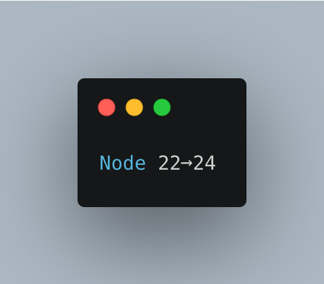
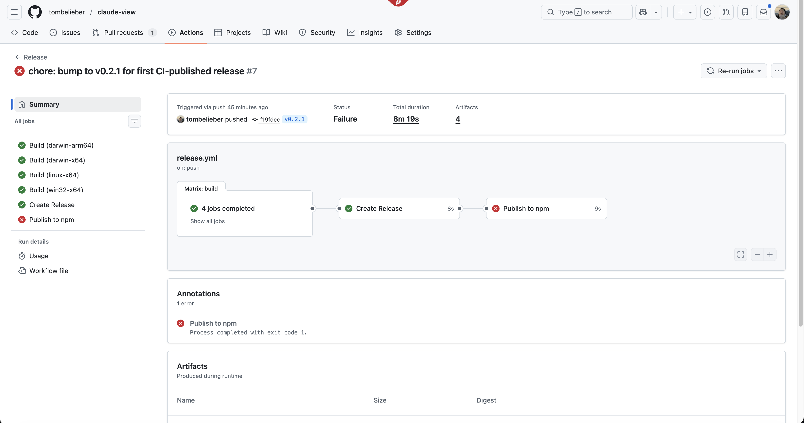
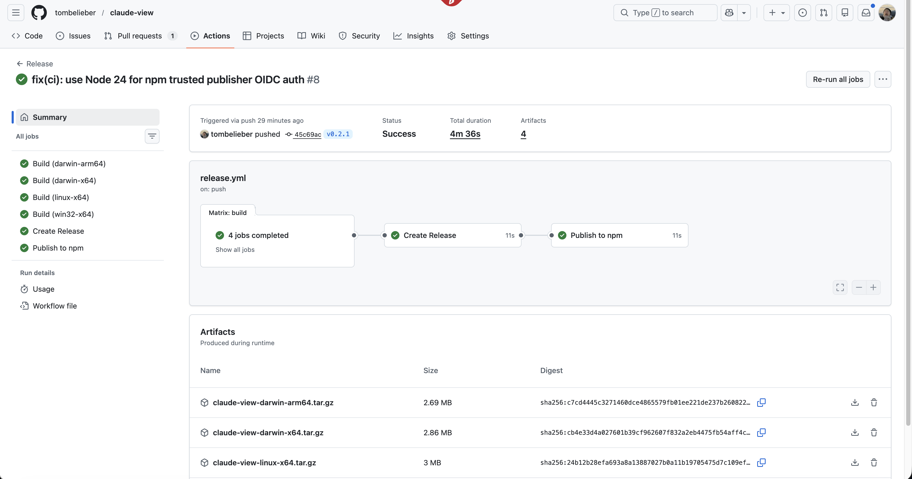

<!-- dev.to: Upload this image via the editor's image button, then paste the CDN URL into cover_image in frontmatter above -->

> **TL;DR:** npm trusted publishing requires **Node 24 / npm >= 11.5.1**. If you're on Node 22, OIDC auth silently fails and npm screams "Access token expired" — when you never had a token to begin with.

## The Setup

I'm building [claude-view](https://github.com/tombelieber/claude-view) — browse your Claude Code sessions in a pretty web UI. Ships as a Rust binary via `npx claude-view`.

The release pipeline:
1. Push a git tag → GitHub Actions builds for 4 platforms
2. Creates a GitHub Release with SHA256 checksums
3. Publishes the npx wrapper to npm

Steps 1-2 worked first try. Step 3? That's where I lost 3 days of my life.

## The Crime Scene

Here's the publish job. Clean. Simple. By the book.

```yaml
publish-npm:
  runs-on: ubuntu-latest
  permissions:
    contents: read
    id-token: write  # for OIDC
  steps:
    - uses: actions/checkout@v4
    - uses: actions/setup-node@v4
      with:
        node-version: "22"
        registry-url: "https://registry.npmjs.org"
    - run: npm publish --provenance --access public
```

Trusted publishers configured on npmjs.com. Everything triple-checked. Hit publish.



```
npm notice publish Signed provenance statement ✅
npm notice publish Provenance published to Sigstore ✅
npm notice Access token expired or revoked. ❌
npm error 404 Not Found ❌
```

**Provenance signing succeeded.** The OIDC token worked for Sigstore. Then npm says "Access token expired."

What token?? I didn't give you a token. *That was the whole point.*

## The Five Stages of Grief

**Denial:** "My config must be wrong." Re-created the trusted publisher. Re-checked every field. Failed again.

**Anger:** "OIDC doesn't actually work." Googled it. Zero results. The feature was too new. Every answer was about `NPM_TOKEN`.

**Bargaining:** "Fine, I'll use a token." Generated a granular token, wired up `NODE_AUTH_TOKEN`. Would've worked. But it felt like putting a key under the doormat when you have a fingerprint scanner.

**Depression:** "Maybe I'll just `npm publish` manually." I actually did this for v0.2.0. From my laptop. Like it's 2019.

**Acceptance:** Then I found this line in the [docs](https://docs.npmjs.com/trusted-publishers):

> **This feature requires npm CLI v11.5.1 or later. You need Node 24.X.**

My CI:

```
npm: 10.9.4    ← too old
node: v22.22.0 ← ships npm 10, not 11
```



npm 10 can detect OIDC environments and sign Sigstore attestations — that code path existed for `--provenance`. But the OIDC-to-registry-auth exchange (the actual trusted publishing part) was added in npm 11.5.1. So npm 10 signs the provenance, then falls back to traditional token auth, finds nothing, and barfs.



## The Fix

Two lines. Two lines cost me 3 days.

```diff
     - uses: actions/setup-node@v4
       with:
-        node-version: "22"
+        node-version: "24"
         registry-url: "https://registry.npmjs.org"

-    - run: npm publish --provenance --access public
+    - run: npm publish --access public
```

1. **Node 22 → 24** (gets npm 11.5.1+ with OIDC auth)
2. **Drop `--provenance`** (automatic now — the flag is redundant)

No `NPM_TOKEN`. No `NODE_AUTH_TOKEN`. No secrets to rotate. Pure OIDC.



## The Working Workflow (Copy-Paste Ready)

```yaml
publish-npm:
  name: Publish to npm
  needs: release
  runs-on: ubuntu-latest

  permissions:
    contents: read
    id-token: write

  steps:
    - name: Checkout
      uses: actions/checkout@v4

    - name: Setup Node.js
      uses: actions/setup-node@v4
      with:
        node-version: "24"
        registry-url: "https://registry.npmjs.org"

    - name: Publish
      run: npm publish --access public
      working-directory: my-package
```

### npmjs.com Setup (One-Time)

1. Manually publish first (`npm login && npm publish --access public`)
2. Go to `npmjs.com/package/YOUR-PKG/access`
3. Add trusted publisher:
   - **Repo owner** / **Repo name** / **Workflow filename** (exact match, case-sensitive)
   - **Environment**: blank

### Checklist

- [ ] `node-version: "24"` (NOT 22, NOT "lts/*")
- [ ] `registry-url: "https://registry.npmjs.org"` in setup-node
- [ ] `id-token: write` permission
- [ ] GitHub repo is **public**
- [ ] No `NODE_AUTH_TOKEN` or `NPM_TOKEN` set

## Why The Error Message Is Terrible

npm 10 in a GitHub Actions environment:

1. Detects OIDC environment ✅
2. Gets OIDC token from GitHub ✅
3. Signs provenance with Sigstore ✅
4. Tries to auth with npm registry using... a traditional token ❌
5. Finds nothing ❌
6. Says "expired or revoked" ❌❌❌

"Expired or revoked" implies you HAD a token. You didn't. npm 10 just can't say "I'm too old for this OIDC thing."

## Things That Will NOT Fix This

| What You'll Try | Why It Won't Work |
|---|---|
| Re-creating trusted publisher config | Config is fine, CLI is too old |
| Adding `NPM_TOKEN` secret | Works, but why bother with trusted publishing then |
| `npm@latest` without Node 24 | npm 11 needs Node 24 runtime |
| Praying | Tested. Ineffective. |

## The Takeaway

npm trusted publishing works. Zero secrets, OIDC-authenticated, Sigstore-attested. Genuinely better than tokens.

But the version trap is real. Every GH Actions tutorial defaults to `node-version: "22"`. The error message blames your config, not your runtime.

**Remember one thing:** `node-version: "24"`.

---

*Built while shipping [claude-view](https://github.com/tombelieber/claude-view) — browse your Claude Code sessions with `npx claude-view`.*
